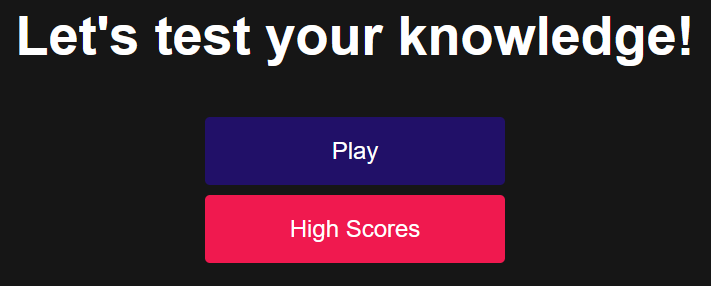

# JavaScript Quiz Web App

## Link to Deployed Application

https://jeffrpar.github.io/quiz-app/index.html

## Description

I was challenged to create a coding quiz web app to assist with coding interview preparation. This was to consist of multiple choice questions and track your score throughout the quiz. If you get a question wrong, it will subtract time from the timer, and if the timer reaches 0 or you answer all questions, the quiz ends and your score is displayed. You can save your score to a leaderboard, however I still have an issue where it records your score twice.

## Credits

I leveraged a tutorial for building a quiz using JavaScript found here: https://youtu.be/f4fB9Xg2JEY

## License

Please refer to the license in the repository.
